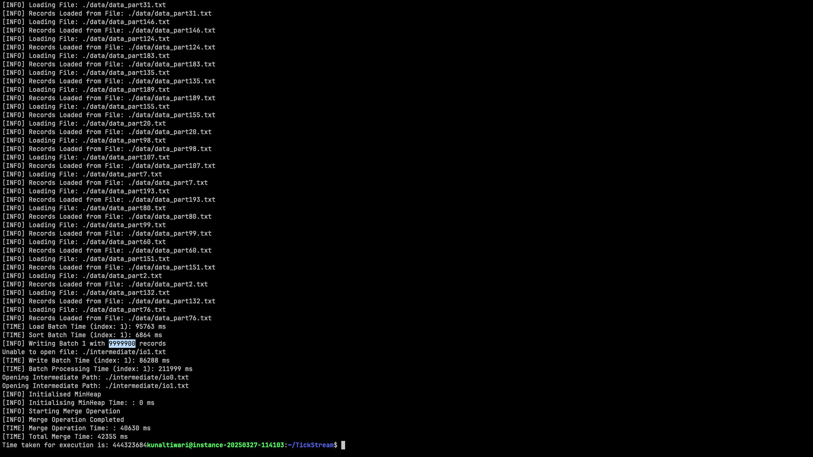

## External K-Way Merge
High Performance C++ tool for efficiently merging and sorting large scale market data across thousands of symbols. The following program has been developed on macOS (ARM, M1)

### Build Instructions

1. Ensure `clang++/gcc` is installed.
2. Compile the project using:

```bash
make build
```

3. Run the executable with the input and output directories:

```bash
./bin/build <your_input_directory> <your_output_directory>
```

### Results
Generated 2GB of sample market data across 200 files using a Python script and successfully merged and sorted the dataset in **444 seconds** using the C++ tool.


